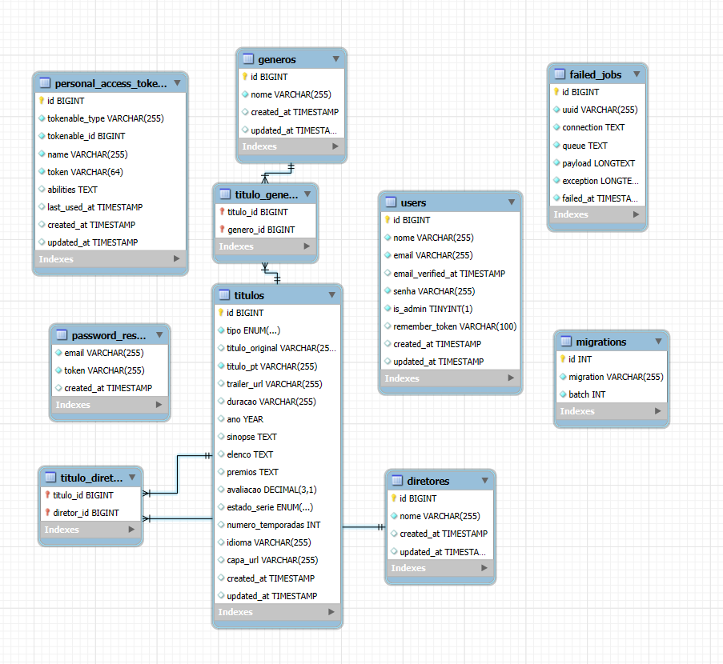

# 🎬 Recruiting Laon - Catálogo de Filmes e Séries

<div align="center">
  <a href="https://github.com/ErickGCA/laon-projeto">
    
  </a>
  <a href="https://github.com/ErickGCA/laon-projeto">
    
  </a>
  <a href="https://github.com/ErickGCA/laon-projeto">
    
  </a>
  <a href="https://github.com/ErickGCA/laon-projeto/commits/main">
    
  </a>
</div>

<div align="center">
  
</div>

---

## ✨ Visão Geral do Projeto

> **Uma plataforma completa de catálogo de filmes e séries desenvolvida como teste de recrutamento para [Laon Labs](https://laonlabs.com).**

A aplicação permite que usuários:
- 🔐 **Criem conta e façam login** com autenticação segura via Laravel Sanctum e NextAuth.js.
- 🎥 **Naveguem pelo catálogo** de filmes e séries com uma interface moderna e responsiva.
- 📝 **Visualizem detalhes completos** dos títulos, incluindo sinopse, elenco, avaliações, gêneros e diretores.
- 👨‍💼 **Gerenciem o conteúdo do catálogo** (para administradores), incluindo adicionar, editar e deletar filmes e séries.

🔗 **Referência de Design (Figma):** [Clique aqui para acessar](https://www.figma.com/design/UNbd6QwutVcqiWoVEtBlCi/Recrutamento?node-id=2-9)
📋 **Coleção Postman (API):** [Clique aqui para acessar](https://drive.google.com/file/d/1VzOATnBPGUXW26RavbBMc5rbIl5wsywL/view?usp=drive_link) <!-- Substitua pelo seu link final, se diferente -->

---

## 🛠️ Stack Tecnológica

<div align="center">

### Backend


 <!-- Cor ajustada para melhor contraste -->

### Frontend


 <!-- Cor ajustada -->

### Mobile (Opcional)


</div>

<details>
<summary>📦 <strong>Lista Completa de Tecnologias e Ferramentas</strong></summary>

**Backend:**
- PHP 
- Laravel 
- MySQL 8
- Laravel Sanctum (para autenticação de API)

**Frontend:**
- Node.js 
- Next.js (App Router)
- React
- TypeScript
- NextAuth.js (para autenticação no frontend)
- Bootstrap 5 (para sistema de grid e componentes base)
- CSS Modules (para estilização customizada)


**Mobile App (Não realizado):**
- React Native
- Expo

**Ferramentas de Desenvolvimento:**
- Git & GitHub
- Composer (gerenciador de dependências PHP)
- NPM / Yarn (gerenciador de dependências Node.js)
- Postman (para testes de API)
- MySQL Workbench 
- VS Code (ou sua IDE de preferência)

</details>

---

## 🚀 Estrutura do Projeto

O repositório está organizado da seguinte forma para clareza e separação de responsabilidades:


recruiting-laon/
├── 📁 recruiting-laon-backend/    # API RESTful desenvolvida com Laravel
├── 📁 recruiting-laon-frontend/   # Aplicação Web desenvolvida com Next.js e React (App Router)
└── 📁 recruiting-laon-app/        # Não Desenvolvido


---

## 💾 Modelagem do Banco de Dados

A modelagem do banco de dados foi um passo fundamental, projetada para suportar as funcionalidades da plataforma, com foco nas entidades principais como Usuários, Títulos (Filmes/Séries), Gêneros e Diretores, e seus relacionamentos.

<div align="center">
  
  <p><em>Diagrama Entidade-Relacionamento do banco de dados da aplicação.</em></p>
</div>

---

## ⚙️ Backend (`recruiting-laon-backend`)

A API RESTful foi construída com Laravel, utilizando Laravel Sanctum para autenticação baseada em token, e segue as melhores práticas para desenvolvimento de APIs.

<details>
<summary>🔧 <strong>Pré-requisitos para o Backend</strong></summary>

- PHP >= 8.1 
- Composer
- MySQL 8
- Servidor Web (Apache/Nginx) ou o servidor embutido do Laravel (`php artisan serve`)

</details>

### 🚀 Instalação e Configuração (Backend)

1.  **Navegue até a pasta do backend:**
    ```bash
    cd recruiting-laon-backend
    ```
2.  **Instale as dependências do Composer:**
    ```bash
    composer install
    ```
3.  **Configure o arquivo de ambiente:**
    * Copie o arquivo de exemplo: `cp .env.example .env`
    * Abra o arquivo `.env` e configure as variáveis de ambiente, especialmente as de conexão com o banco de dados (`DB_DATABASE`, `DB_USERNAME`, `DB_PASSWORD`, etc.).
4.  **Gere a chave da aplicação Laravel:**
    ```bash
    php artisan key:generate
    ```
5.  **Execute as migrations para criar as tabelas e os seeders para popular o banco com dados iniciais:**
    ```bash
    php artisan migrate:fresh --seed
    ```
6.  **Crie o link simbólico para o storage (para acesso público a imagens):**
    ```bash
    php artisan storage:link
    ```
7.  **Inicie o servidor de desenvolvimento do Laravel:**
    ```bash
    php artisan serve
    ```
> 🌐 A API estará disponível em: `http://127.0.0.1:8000/api/` (ou a porta que você configurar).

---

## 🌐 Endpoints da API (Backend)

A API fornece os seguintes endpoints principais:

<div align="center">

| Método | Endpoint           | Descrição                                  | Autenticação Requerida | Permissão de Admin |
|--------|--------------------|--------------------------------------------|------------------------|--------------------|
| `POST` | `/api/register`    | Registrar um novo usuário                  | Não                    | Não                |
| `POST` | `/api/login`       | Autenticar um usuário e obter token        | Não                    | Não                |
| `POST` | `/api/logout`      | Invalidar o token do usuário logado        | Sim (Sanctum Token)    | Não                |
| `GET`  | `/api/user`        | Obter dados do usuário autenticado         | Sim (Sanctum Token)    | Não                |
| `GET`  | `/api/titulos`     | Listar todos os títulos (ou paginados)     | Sim (Sanctum Token)    | Não                |
| `GET`  | `/api/titulos/{id}`| Obter detalhes de um título específico      | Sim (Sanctum Token)    | Não                |
| `POST` | `/api/titulos`     | Criar um novo título                       | Sim (Sanctum Token)    | Sim                |
| `PUT`  | `/api/titulos/{id}`| Atualizar um título existente (usar POST com `_method=PUT` para FormData) | Sim (Sanctum Token) | Sim |
| `DELETE`| `/api/titulos/{id}`| Deletar um título                          | Sim (Sanctum Token)    | Sim                |
| `GET`  | `/api/generos`     | Listar todos os gêneros (para formulários) | Sim (Sanctum Token)    | Não (ou Admin)     |
| `GET`  | `/api/diretores`   | Listar todos os diretores (para formulários)| Sim (Sanctum Token)    | Não (ou Admin)     |

</div>

> 📋 **Coleção Postman detalhada:** [Acesse aqui](https://drive.google.com/file/d/1VzOATnBPGUXW26RavbBMc5rbIl5wsywL/view?usp=drive_link) <!-- Substitua pelo seu link final, se diferente -->

---

## 🖥️ Frontend (`recruiting-laon-frontend`)

A interface do usuário foi desenvolvida com Next.js (utilizando o App Router) e React, com TypeScript para tipagem estática, e estilizada com Bootstrap e CSS Modules, seguindo o design de referência do Figma.

<details>
<summary>🔧 <strong>Pré-requisitos para o Frontend</strong></summary>

- Node.js
- NPM ou Yarn

</details>

### 🚀 Instalação e Configuração (Frontend)

1.  **Navegue até a pasta do frontend:**
    ```bash
    cd recruiting-laon-frontend
    ```
2.  **Instale as dependências:**
    ```bash
    npm install
    # ou
    # yarn install
    ```
3.  **Configure as variáveis de ambiente:**
    * Crie um arquivo `.env.local` na raiz da pasta do frontend.
    * Adicione as seguintes variáveis (ajuste a URL da API se necessário):
      ```env
      NEXT_PUBLIC_LARAVEL_API_URL=[http://127.0.0.1:8000](http://127.0.0.1:8000)
      AUTH_SECRET=gere_um_secret_forte_aqui_ex_openssl_rand_base64_32
      ```
      * **Importante:** Substitua `gere_um_secret_forte_aqui...` por um segredo real e forte.
4.  **Inicie o servidor de desenvolvimento do Next.js:**
    ```bash
    npm run dev
    # ou
    # yarn dev
    ```
> 🌐 A aplicação web estará disponível em: `http://localhost:3000` (ou outra porta, verifique o console).

---

## 🖼️ Previews da Interface

<div align="center">

### 🔐 Tela de Login


### 🎬 Dashboard Principal (Catálogo)


### 📄 Tela de Detalhes do Título


### 🛠️ Painel de Administração (CRUD de Títulos)


</div>

---


## 🎯 Funcionalidades Implementadas

- [x] 🔐 **Sistema de Autenticação Completo** (Registro, Login, Logout via API e Frontend)
- [x] 🎥 **Catálogo de Filmes e Séries** (Listagem e separação por tipo)
- [x] 📝 **Página de Detalhes dos Títulos** (Exibição de informações completas)
- [x] 🛡️ **Autorização baseada em Role** (Usuário comum vs. Administrador)
- [x] 👨‍💼 **Painel Administrativo Básico** (Listagem de títulos com ações CRUD)
- [x] ✨ **Funcionalidade de Criar Títulos** (Admin, via modal no frontend e API)
- [x] ✏️ **Funcionalidade de Editar Títulos** (Admin, via modal no frontend e API)
- [x] 🗑️ **Funcionalidade de Deletar Títulos** (Admin, via interface e API)
- [x] 🖼️ **Upload e Gerenciamento de Imagens de Capa** (Admin, via backend Laravel)
- [x] 📄 **Paginação de Dados** (No painel de admin e potencialmente no catálogo)
- [x] 🎨 **Interface Responsiva** (Utilizando Bootstrap e CSS customizado)
- [x] ⚙️ **API RESTful Robusta** com Laravel
- [ ] 🔍 **Sistema de Busca Avançada** no catálogo
- [ ] ⭐ **Sistema de Avaliações** pelos usuários
- [ ] 📱 **Desenvolvimento do App Mobile** 

---

## 🤔 Desafios e Aprendizados

Durante o desenvolvimento deste projeto, enfrentei e superei diversos desafios técnicos e conceituais, que contribuíram significativamente para meu aprendizado:

> **🔧 Integração Backend-Frontend:** A configuração da autenticação com Laravel Sanctum e NextAuth.js, incluindo o fluxo de tokens e a propagação de roles (como `is_admin`) para a sessão do frontend, exigiu atenção aos detalhes e depuração cuidadosa. A sincronização entre as expectativas do `Auth::attempt()` do Laravel e os dados enviados pelo NextAuth foi um aprendizado chave.
>
> **🔄 Gerenciamento de Estado e Efeitos no React/Next.js:** Lidar com loops de requisição no `useEffect` devido a dependências instáveis (como objetos de sessão ou funções de callback) e refatorar para usar `useCallback` e dependências primitivas de forma correta foi um desafio importante para garantir a performance e estabilidade da interface de administração.
>
> **🖼️ Upload de Arquivos e CRUD Completo:** Implementar o upload de imagens de capa no formulário de admin, garantindo que o backend Laravel processe `FormData` corretamente (especialmente para requisições `PUT` simuladas com `_method`), e que o frontend envie os dados de forma adequada.
>
> **🛡️ Autorização e Proteção de Rotas:** Configurar Gates no Laravel e o middleware no Next.js para proteger rotas de administração e garantir que apenas usuários autorizados possam realizar operações CRUD foi um exercício prático valioso em segurança de aplicações.
>
> **🐛 Depuração de Comportamentos Inesperados:** A investigação de por que o middleware do Next.js não parecia executar (devido à sua localização incorreta quando se usa o diretório `src/`) e por que o `schema:dump` estava interferindo nas migrations foram momentos de aprendizado sobre o funcionamento interno e as convenções do Next.js.

**Principais aprendizados:**
- Aprofundamento significativo em NextAuth.js e sua integração com backends customizados.
- Melhor compreensão das nuances do App Router do Next.js, Server Components, Client Components e Middleware.
- Prática robusta com o sistema de arquivos e upload no Laravel (Storage, links simbólicos).
- Reforço na importância da depuração sistemática e da verificação de configurações em todas as camadas da aplicação.
- Valor da componentização e da separação de responsabilidades no frontend para manutenibilidade.

---

## 👨‍💻 Sobre o Desenvolvedor

<div align="center">
  <a href="https://github.com/ErickGCA">
    
  </a>
  <br/>
  <strong>Érick Gonçalves Cabral</strong>
  <br/>
  <em>Desenvolvedor Full Stack apaixonado por criar soluções inovadoras e desafios de código.</em>
  <br/><br/>
  <a href="https://github.com/ErickGCA" target="_blank">
    
  </a>
  <a href="https://www.linkedin.com/in/erick-cabralgca/" target="_blank">
    
  </a>
  <br/>
  <a href="mailto:erickgcabral@gmail.com"> 
    
  </a>
</div>

---

## 🙏 Agradecimentos

<div align="center">
  <br/>
  <strong>Agradeço imensamente à equipe da <a href="https://laonlabs.com" target="_blank">Laon Labs</a> pela oportunidade de participar deste desafiador e gratificante processo seletivo!</strong>
  <br/><br/>
  <em>Este projeto representa minha dedicação, paixão por desenvolvimento de software e a busca contínua por aprendizado e excelência.</em>
  <br/><br/>

</div>

---

## 📄 Licença

Este projeto foi desenvolvido exclusivamente para fins de avaliação técnica como parte do processo seletivo da Laon Labs.

---

<div align="center">
  

</div>
